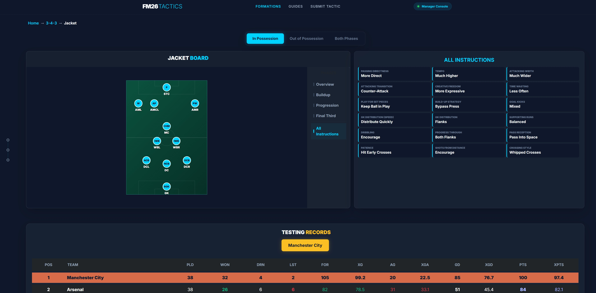

# ⚽ FM26 Tactics Hub

> **Master the Pitch.** A high-performance tactical database and analysis tool for Football Manager 2026, built with Blazor WebAssembly.


FM26 Tactics Hub is a modern, data-driven web application designed for managers to browse, analyze, and download elite tactical setups. Moving beyond static forum posts, this hub features an **interactive tactical engine** that visualizes exactly how team instructions and player roles transform between attacking and defensive phases.

---

## 🚀 Key Features

### 🛡️ Interactive Tactical Board
*   **Dual-Phase Visualization:** Seamlessly toggle between **In Possession** (Cyan) and **Out of Possession** (Red) to see the team's shape change.
*   **Dynamic Transitions:** Watch player icons smoothly slide to their defensive responsibilities (e.g., watching an AMCL drop into a defensive MCL).
*   **Smart Overlays:** Hover over player icons to view a detailed instruction dossier. Boxes intelligently "flip" and shift horizontally to stay visible on all screen sizes.
*   **Tactical Phases:** Filter instructions by Buildup, Progression, and Final Third with real-time pitch zone highlighting.

### 📊 Professional Testing Records
*   **League Table Analytics:** High-fidelity results tables with custom color-coding for Won/Lost/Draw and Expected Stats (xG, xGA, XPTS).
*   **Smart Benchmarking:** Automatic calculation of Goal Difference (GD) and Expected Goal Difference (xGD).
*   **Tested Team Highlighting:** The specific team used in the simulation is highlighted with a distinct Burnt Orange/Yellow background for instant performance context.

### ⚡ Technical Excellence
*   **Zero-JS Navigation:** A custom-built, purely C# sticky timeline sidebar for jumping between Tactics, Results, and Downloads.
*   **Optimized UI:** Designed for 1080p displays with a unified 660px panel height and high-density 3-column data grids.
*   **Architecture:** Fully refactored service-oriented design. The UI acts as a template, pulling data dynamically from a central Tactic Service.

---

## 🛠️ Tech Stack

*   **Framework:** [.NET 9 / Blazor WebAssembly](https://dotnet.microsoft.com/apps/aspnet/web-apps/blazor)
*   **Styling:** CSS3 Custom Properties, Glassmorphism, and Bootstrap 5
*   **Icons:** [Bootstrap Icons](https://icons.getbootstrap.com/)
*   **Data Structure:** C# Dictionary and List-based Service logic (easily migratable to JSON/SQL)

---

## 📂 Project Structure

```text
FM26_Tactics/
├── Models/
│   └── Tactic.cs          # Unified schema for tactical data, player roles & league results
├── Services/
│   └── TacticService.cs   # The central database (The single point of truth for all tactics)
├── Pages/
│   ├── Home.razor         # Slick landing page categorized by formations
│   ├── FormationDetail    # Tactic listing cards for specific shapes (e.g., 3-4-3)
│   └── TacticView.razor   # The "Perfect Version" dynamic tactical template
└── wwwroot/
    ├── images/            # Organized shots (images/{formation}/{slug}.jpg)
    └── tactics/           # Downloadable .fmf files (tactics/{formation}/{slug}.fmf)